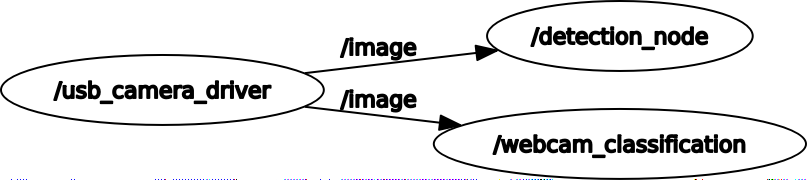

# ROS2 Real Time Classification and Detection
This repository contains ROS2 packages for carrying out real time classification and detection for images using PyTorch.

It also contains packages which use TensorRT to perform faster inference via `torch2trt`.

An ImageNet pre-trained SqueezeNet model is used for classification.

For Object Detection, the MobileNetV1 SSD model is used. 

These models are converted to their TRT formats for faster inference using `torch2trt`

The packages have been tested on NVIDIA Jetson Xavier AGX with Ubuntu 18.04, ROS Eloquent and PyTorch version 1.6.0
 
### Package Dependencies:

- Use either `image_tools`: https://github.com/ros2/demos/tree/eloquent/image_tools or `usb_camera`: https://github.com/klintan/ros2_usb_camera for obtaining the live stream of images from the webcam (if using `usb_camera` link, make sure the name of this package is `usb_camera_driver`, rename the folder if needed.)

- `vision_msgs`: https://github.com/Kukanani/vision_msgs/tree/ros2

- `cv_bridge`: https://github.com/ros-perception/vision_opencv/tree/ros2/cv_bridge (May already be present, check by running `ros2 pkg list`)

Build these packages into your workspace. Make sure ROS2 versions are present.


### Other Dependencies:

`Pytorch` and `torchvision` (if using Jetson, refer: https://forums.developer.nvidia.com/t/pytorch-for-jetson-version-1-6-0-now-available/72048)

`OpenCV` (Should already exist if Jetson has been flashed with JetPack)

`torch2trt` (refer: https://github.com/NVIDIA-AI-IOT/torch2trt)

## Steps before using the packages

- Make sure all the package dependencies are fulfilled and the packages are built in your workspace

- Clone this repository into your workspace

- Execute the following to create a new folder `ros2_models` in `home` for storing all the models and labels needed:

``` 
cd
mkdir ros2_models 
```


## Build and run live_classifier


- Copy the `imagenet_classes.txt` from the `live_classifier` folder to your `home/ros2_models` directory. This has the labels for the classification model.

- Navigate into your worksapce. Run: `colcon build --packages-select live_classifier`

- Next, open 2 terminals and navigate to your workspace. Run both these commands sequentially: 
`source /opt/ros/eloquent/setup.bash` and 
`. install/setup.bash` This will source the terminals.

- Now, first begin streaming images from your webcam. In one of the terminals: If using image_tools package: `ros2 run image_tools cam2image`
If using usb_camera package: `ros2 run usb_camera_driver usb_camera_driver_node`

- In the second terminal (should be sourced) :
`ros2 run live_classifier live_classifier --ros-args -p model:=resnet50`

 Other model options include `resnet18`, `squeezenet`, `alexnet` which can be passed with the `model:=resnet18` for example.

- The classification node will subscribe to the image topic and will perform classification.
It will display the label and confidence for the image being classified.
Also, a window will appear which will display the webcam image stream.

- The results of the classfication are published as `Classification2D` messages.
Open a new terminal and source it. Run: 
`ros2 topic echo classification`


## Build and run live_detection

Download the model weights and labels from the following links: 
- For the weights: https://storage.googleapis.com/models-hao/mobilenet-v1-ssd-mp-0_675.pth
- For the labels: https://storage.googleapis.com/models-hao/voc-model-labels.txt

Place these files in `home/ros2_models` directory.

- Navigate into your worksapce. Run: `colcon build --packages-select live_detection`

- Next, open 2 terminals and navigate to your workspace. Run both these commands sequentially: 
`source /opt/ros/eloquent/setup.bash` and 
`. install/setup.bash` This will source the terminals.

- Now, first begin streaming images from your webcam. In one of the terminals: If using image_tools package: `ros2 run image_tools cam2image`
If using usb_camera package: `ros2 run usb_camera_driver usb_camera_driver_node`

- In the second terminal (should be sourced) :
`ros2 run live_detection live_detector`

- The detection node will subscribe to the image topic and will perform detection.
It will display the labels and probabilities for the objects detected in the image.
Also, a window will appear which will display the object detection results in real time.

- The results of the detection are published as `Detection2DArray` messages.
Open a new terminal and source it. Run: 
`ros2 topic echo detection`

## RQT Graph when both Detection and Classifier Nodes are running



- The results are published to `vision_msgs`

## Build and run trt_live_classifier

- The package can now be built and run. Navigate into your workspace run `colcon build --packages-select trt_live_classifier`

- Next, open 2 terminals and navigate to your workspace. Run both these commands sequentially: 
`source /opt/ros/eloquent/setup.bash` and 
`. install/setup.bash` This will source the terminals.

- Now, first begin streaming images from your webcam. In one of the terminals: If using image_tools package: `ros2 run image_tools cam2image`
If using usb_camera package: `ros2 run usb_camera_driver usb_camera_driver_node`

- In the second terminal (should be sourced):
`ros2 run trt_live_classifier trt_classifier --ros-args -p model:=resnet50`

 Other model options include `resnet18`, `squeezenet`, `alexnet` which can be passed with the `model:=resnet18` for example.
 Running it the first time will be slow as the corresponding TRT module will be generated for your hardware configuration.

- This will now create a node which carries out faster inference which is clear from the `inference time` which is displayed on the terminal as well. 

- The results of the classfication are published as `Classification2D` messages.
Open a new terminal and source it. Run: 
`ros2 topic echo trt_classification`

## Build and run trt_live_detector:

- Make sure the weights and labels from `live_detection` section are placed in the `ros2/models` directory. They will be needed for generating the TRT Module.

- The package can now be built and run. Navigate into your workspace run `colcon build --packages-select trt_live_detector`

- Next, open 2 terminals and navigate to your workspace. Run both these commands sequentially: 
`source /opt/ros/eloquent/setup.bash` and 
`. install/setup.bash` This will source the terminals.

- Now, first begin streaming images from your webcam. In one of the terminals: If using image_tools package: `ros2 run image_tools cam2image`
If using usb_camera package: `ros2 run usb_camera_driver usb_camera_driver_node`

- In the second terminal (should be sourced):
`ros2 run trt_live_detector trt_detector`

- The results of the classfication are published as `Classification2D` messages.
Open a new terminal and source it. Run: 
`ros2 topic echo trt_detection`

- This will now create a node which carries out faster object detection which is clear from the `inference time` and is displayed on the terminal as well.


## References

- PyTorch implementation of the MobileNetV1 SSD model from https://github.com/qfgaohao/pytorch-ssd is used. The download links for the weights and the labels for `live_detection` use the pre-trained ones provided in the repository.

- SqueezeNet pretrained model on ImageNet from `torchvision` is used directly.


